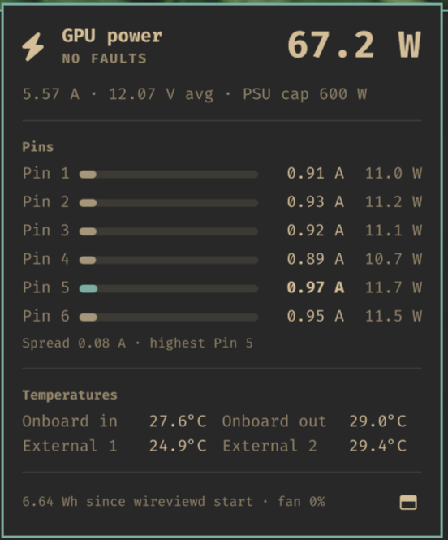

# WireView for Omarchy

An Omarchy shell bar widget for the Thermal Grizzly WireView Pro II (standard and Noctua Edition) GPU power monitor.



- **Bar:** connector power in watts. The icon turns urgent on an active fault or when a pin carries more than the connector's 9.5 A rating.
- **Popup (left click):** total power, current and average voltage, current per pin with the highest pin highlighted, spread between pins, all four temperatures, logged faults, energy and fan duty.
- **Right click:** opens `wireviewctl top` in a terminal.
- **Notifications:** a critical desktop notification when a new fault appears (over-current, per-wire over-current, over-power, current imbalance, over-temperature).

## Requirements

[wireview-hwmon](https://github.com/emaspa/wireview-hwmon) with its kernel module, so the device shows up as a hwmon sensor:

```bash
yay -S wireview-hwmon wireview-hwmon-dkms
sudo systemctl enable --now wireviewd
sensors 'wireview-*'
```

The widget only reads `/sys/class/hwmon/*` (found by name, since the `hwmonN` index changes between boots). It needs no access to the serial port or the daemon's socket, and no group membership.

## Install

```bash
ln -s "$PWD" ~/.config/omarchy/plugins/martinmose.wireview
omarchy plugin enable martinmose.wireview
```

IPC: `quickshell ipc -p /usr/share/omarchy/shell call martinmose.wireview toggle`

## License

[MIT](LICENSE)
